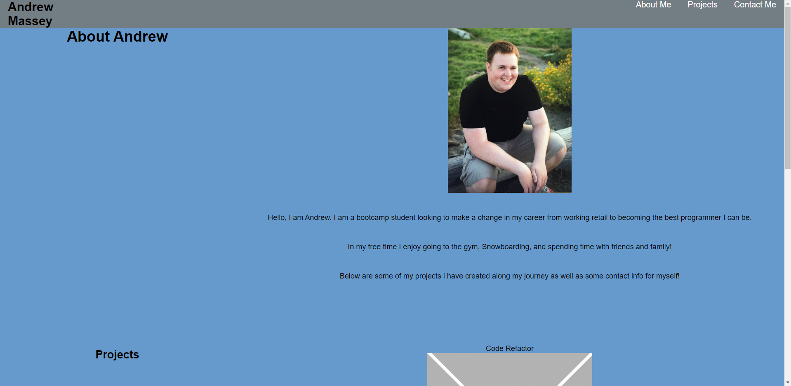
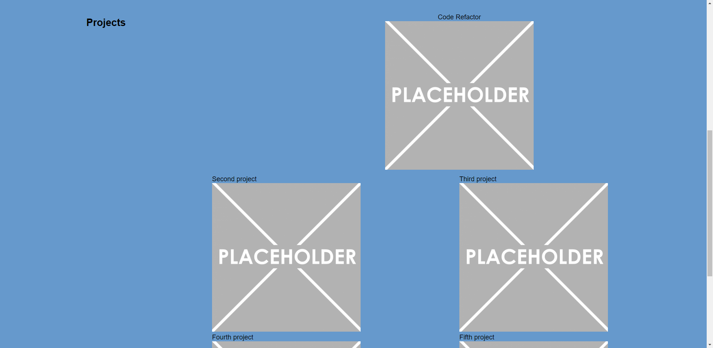
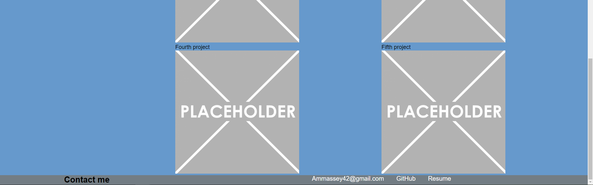

# portfolio

## Description

This project was to create a portfolio to showcase all my upcoming projects. The goal of this project was to make elements that move with the different viewport sizes so that it is accessable on many different devices users could be looking at it from. I used flexbox to allow my website to be accessable on different devices.

## screenshots

## Link to deployed application
[portfolio](https://amassey42.github.io/portfolio/)